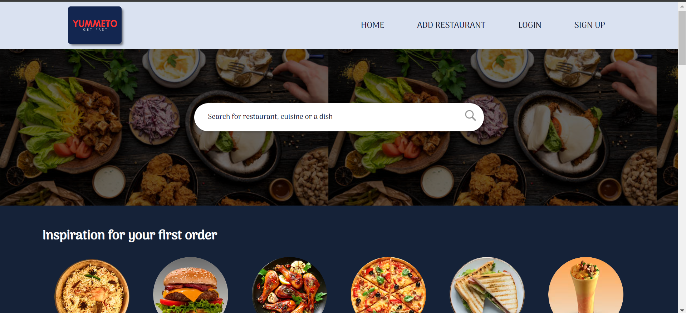
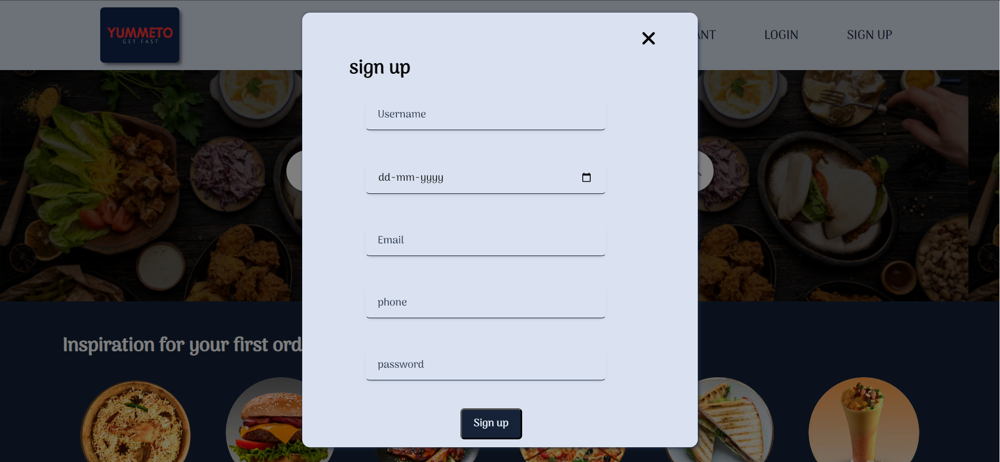
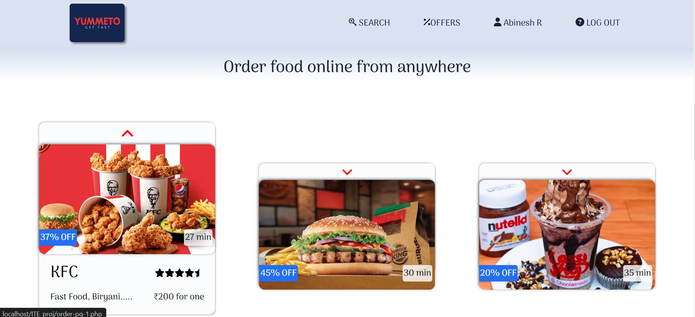
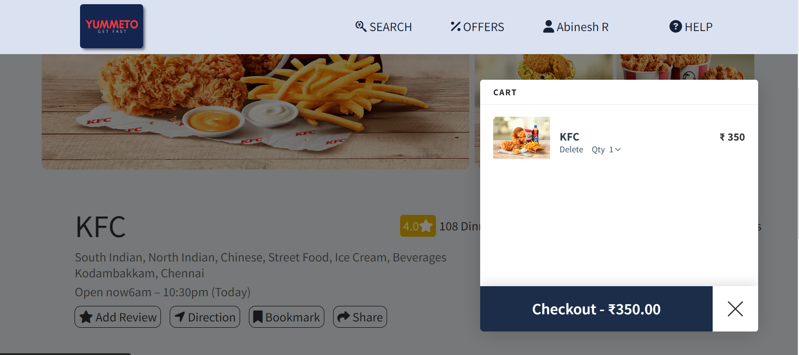

# 🍽️ Online Food Delivery Platform

Welcome to the **Online Food Delivery Platform** repository! This project is a web-based application designed to facilitate online food ordering. Developed using HTML, CSS, and JavaScript, it offers a seamless user experience with login functionality and attractive design elements for easy navigation.

---

## 🍔 Features

- **User Authentication**
  - 🔒 Login functionality with secure signup validation.
  
- **User-Friendly Interface**
  - 🌟 Designed with easy navigation and visually appealing elements.

---

## 🛠️ Technologies Used

- **HTML**: For the basic structure of the web pages.
- **CSS**: For styling and layout.
- **JavaScript**: For dynamic interactions and functionality.

---

## 📸 Screenshots

### 🏠 Home Page

*Screenshot of the homepage.*

### 🔐 Signup Page

*Screenshot of the signup page.*

### 🍲 Food Cards

*Screenshot of the food cards.*

### 🛒 Add to Cart

*Screenshot of the add to cart functionality.*

---

## 🤝 Contributing

We welcome contributions to enhance the platform. To contribute:

1. **Fork the repository.**
2. **Create a new branch (`git checkout -b feature-branch`).**
3. **Make your changes.**
4. **Commit your changes (`git commit -m 'Add new feature'`).**
5. **Push to the branch (`git push origin feature-branch`).**
6. **Open a Pull Request.**

---

## 📄 License

This project is licensed under the MIT License. See the [LICENSE](LICENSE) file for more details.

---

## 📬 Contact

If you have any questions, suggestions, or feedback, feel free to reach out to us. We're always open to hearing from the community!

- **Project Maintainer**: Your Name
- **Email**: [yourname@example.com](mailto:yourname@example.com)
- **GitHub**: [yourusername](https://github.com/yourusername)
- **LinkedIn**: [Your LinkedIn Profile](https://www.linkedin.com/in/yourprofile/)
- **Twitter**: [@yourusername](https://twitter.com/yourusername)

For more information or to report issues, you can also visit the [Issues](https://github.com/yourusername/food-delivery-platform/issues) page on GitHub.

---

Thank you for checking out the Online Food Delivery Platform! We appreciate your interest and support. Happy ordering! 🍔🍕🍜
